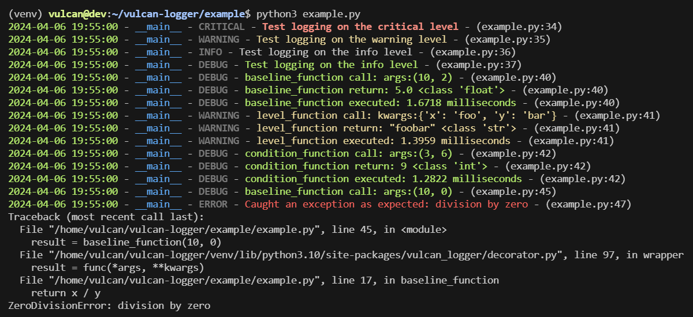

# Medusa Logger
Medusa Logger is a Python package that provides a customizable logging utility with support for automatic inclusion of caller's filename and line number in logs. It aims to simplify logging in Python applications by offering features such as log level configuration, colored logs, and conditional logging.

[View the full documentation here](https://medusa-logger.readthedocs.io/en/latest/)



## Features
- **Caller Information**: Automatically includes the caller's filename and line number in log messages for better traceability.
- **Customizable Log Levels**: Easily configure log levels to control the severity of messages that the logger will process.
- **Colored Logs**: Enhance log readability with colored logs for different log levels.
- **Conditional Logging**: Conditionally log messages based on specific conditions to control verbosity.

## Installation
You can install Medusa Logger via pip:

```bash
pip install medusa-logger
```

## Usage
[Please check out example usage here](https://github.com/nodadyoushutup/medusa-logger/blob/main/example/example.py)

### Basic Logging
1. Import the Logger class from the medusa_logger.logger module.
2. Initialize a Logger instance with a name and an optional log level. The default log level is INFO.
3. Use the logging methods (debug, info, warning, error, critical) to log messages at various severity levels.
```python
from medusa_logger.logger import Logger

# Initialize the logger with a custom name and log level
logger = Logger(name='application_log', level='DEBUG')

# Log messages at different levels
logger.debug("Debug message for detailed diagnostic information")
logger.info("Info message for general information")
logger.warning("Warning message for potential issues")
logger.error("Error message for serious problems")
logger.critical("Critical message for severe conditions")
```

### Function Logging with Decorators
Medusa Logger provides a logging decorator that can be applied to functions to automatically log calls, returns, and execution times. To use this feature:

1. Import the log decorator from the medusa_logger.decorator module.
2. Apply the @log decorator to any function. You can optionally specify a log level or a condition for logging.
```python
from medusa_logger.decorator import log

@log(level="DEBUG")
def compute_sum(a, b):
    """Function to demonstrate logging with a decorator."""
    return a + b

@log(condition=lambda args, kwargs: args[0] > args[1])
def conditional_log_example(x, y):
    """Function that logs only if the condition is true."""
    return x * y

# Call the decorated functions
sum_result = compute_sum(1, 2)
product_result = conditional_log_example(5, 3)
```

### Advanced Configuration
**Setting Global Log Level**: You can set a global log level by modifying the environment variable `MD_LOG_LEVEL` before initializing your logger. This can be done within your script or externally through your system's environment settings. By default it is set to `DEBUG`.

Python
```python
import os
os.environ["MD_LOG_LEVEL"] = "WARNING"
```
Bash
```bash
export MD_LOG_LEVEL="WARNING"
```

### Handling Exceptions
Medusa Logger makes it easy to log exceptions. Use the logging methods within exception handling blocks to log errors and critical issues.

```python
try:
    # Potentially problematic code
    result = 10 / 0
except ZeroDivisionError as e:
    logger.error(f"Caught an exception: {e}")
```

## Contributing
Contributions to Medusa Logger are welcome! To contribute, follow these steps:

1. Fork the repository and clone it to your local machine.
2. Install the development dependencies by running `pip install -r requirements.txt`.
3. Make your changes and ensure tests pass by running `pytest`.
4. Submit a pull request with a clear description of your changes and why they are beneficial.

Please adhere to the [code of conduct](https://github.com/jacobfholland/medusa-logger/blob/main/docs/CODE_OF_CONDUCT.md) when contributing to this project.

## License
This project is licensed under the MIT License. See the [LICENSE](https://github.com/jacobfholland/medusa-logger/blob/main/LICENSE) file for details.
